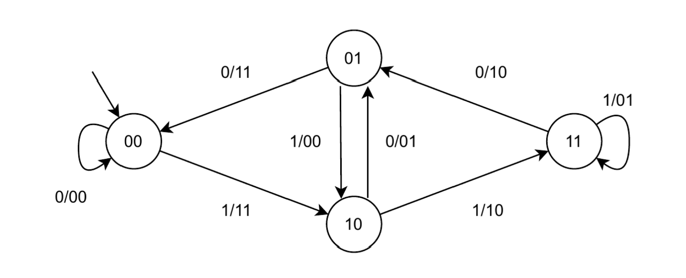

# Digital Logic Design project 2021/2022

Project for Digital Logic (Reti Logiche) course 2021/22 at Politecnico di Milano.

**Professor**:  William Forniciari  

**Final grade**: 30/30 cum laude  

### Project Specification

This project aims at the implementation of an HW module described in VHDL which interfaces with memory and follows the following specification: the module takes in a continuous sequence of W words, each consisting of 8 bits, and outputs a continuous sequence of Z words, each consisting of 8 bits. Each input word is serialized, creating a continuous 1-bit stream, denoted as U. The 1-bit stream U undergoes 1/2 convolutional coding, where each bit is encoded with 2 bits. This operation results in an output stream Y, which is obtained by alternating the concatenation of the two output bits.

### Tools
**Vivado** - synthesis and analysis of hardware description language (HDL) designs software.  
